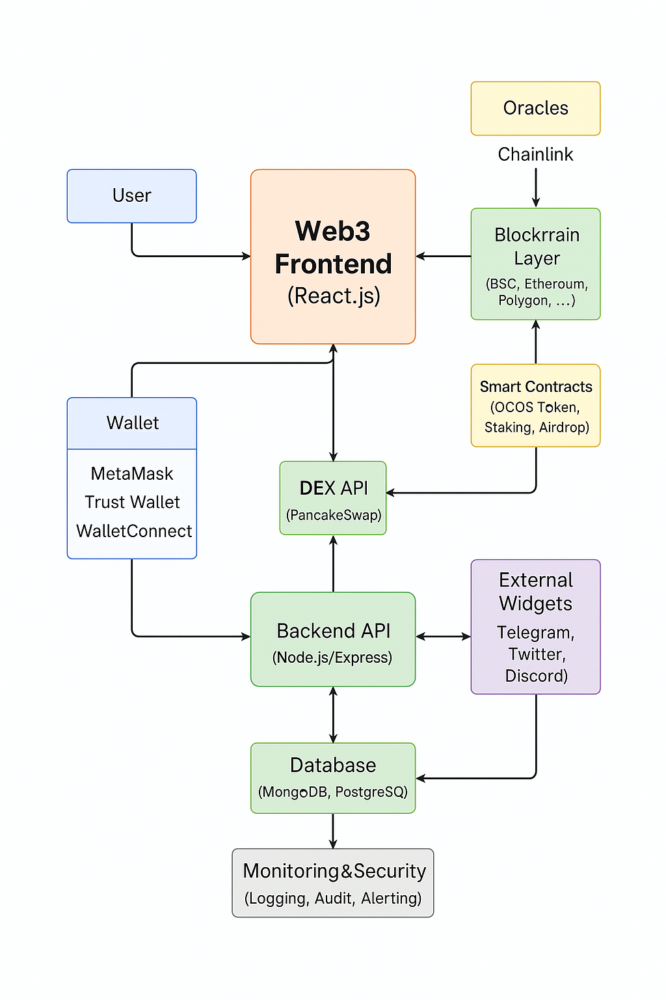

# Data Flow – OCOS Web3 Dashboard

## Overview

This document provides a detailed, step-by-step description of how data moves throughout the OCOS Web3 Dashboard platform, from user interaction in the UI to the blockchain, backend (if used), and back to the user interface. The flow ensures high performance, security, and a seamless user experience.

---

## 1. User Interaction

- **Wallet Connection**  
  The user visits the dashboard and connects their crypto wallet (e.g., MetaMask, Trust Wallet, WalletConnect).  
  - The app requests account access via standard Web3 providers.
  - User’s public address is read and stored in the app state.

- **Language & Theme Selection**  
  The user may change language (AZ, EN, TR) and UI theme (light/dark).  
  - These settings are managed locally (browser storage) and instantly update UI text and colors.

---

## 2. Data Fetching (Frontend)

- **Live Price & Liquidity Data**  
  The frontend calls third-party APIs (PancakeSwap, Chainlink, BSCScan) to fetch:
    - Token price (OCOS/BNB, BNB/USD)
    - Liquidity pool status (TVL, pair reserves, APY)
    - Recent trades and transaction history

- **Smart Contract State**  
  The dashboard uses Web3.js/Ethers.js to read:
    - User balances (OCOS, LP tokens)
    - Staking positions
    - Eligibility for airdrop or rewards

---

## 3. Transaction Initiation

- **User Actions**  
  The user can:
    - Stake/unstake OCOS
    - Claim airdrop
    - Add/remove liquidity
    - Transfer tokens

- **Signing & Broadcasting**  
  - Each action triggers a transaction.
  - The frontend generates and requests the transaction from the user’s wallet.
  - User signs the transaction; it is broadcasted to the blockchain (BSC mainnet).

---

## 4. Blockchain Processing

- **Transaction Confirmation**  
  - The blockchain processes the transaction.
  - Transaction hash and status are returned.
  - Events (e.g., `Stake`, `AirdropClaimed`) are emitted by smart contracts.

- **Listening to Events**  
  - The frontend subscribes to contract events.
  - UI updates in real time as blocks are mined and events are detected.

---

## 5. Backend Integration (Optional)

- **Eligibility & Analytics**  
  - For advanced features (leaderboards, off-chain rewards, analytics), the dashboard can query a backend API.
  - Backend may verify user activity, calculate statistics, or send notifications.

- **Security**  
  - No private keys or sensitive data ever leaves the user's device.
  - All on-chain interactions are signed client-side.

---

## 6. Data Visualization & Updates

- **Real-Time UI Updates**  
  - All fetched and on-chain data is visualized in charts, tables, and dashboard widgets.
  - Loading, confirmation, error, and success states are clearly shown.
  - Multi-language content updates dynamically.

---

## 7. Error Handling & Feedback

- **Graceful Fallbacks**  
  - If an API or blockchain node is unreachable, the app shows helpful error messages and tries alternative endpoints.
  - User is always informed about transaction status, errors, or required actions.

---

## Data Flow Diagram

---

## Best Practices

- Use HTTPS and WebSocket connections for data integrity and security.
- Throttle and cache API calls to avoid rate limiting.
- Always verify user signatures before sending on-chain.
- Monitor event logs for accurate, real-time dashboard updates.

---

**See also:**  
- [architecture-overview.md](architecture-overview.md)  
- [smart-contracts.md](smart-contracts.md)  
- [api-schema.md](api-schema.md)  
